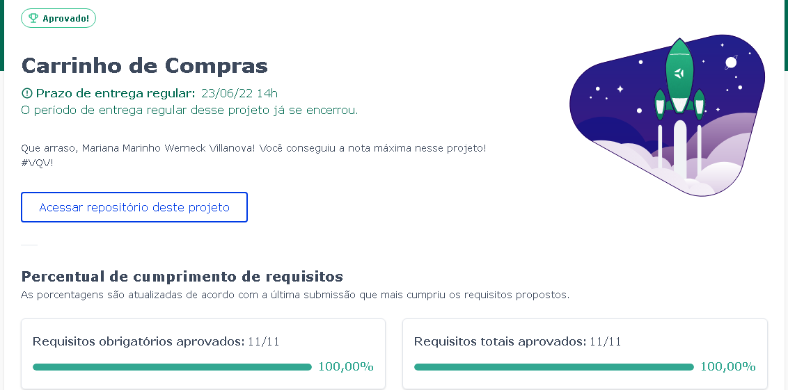
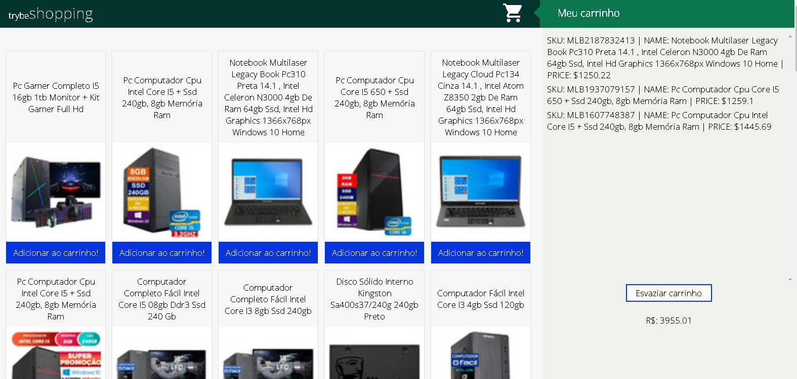

# Projeto Shopping Cart!

Nesse projeto foi criado uma aplicação utilizando a API do [Mercado Livre](https://developers.mercadolivre.com.br/pt_br/itens-e-buscas), HTML, CSS, JavaScript e LocalStorage.

## Desempenho:

O projeto Shopping Cart foi desenvolvido por [Mariana Werneck](https://www.linkedin.com/in/marinhomariana8/) durante o curso de Desenvolvimento Web na [Trybe](https://www.betrybe.com/)! Foi adquirido 100% do projeto total.

## Preview:

## Connect:

 
